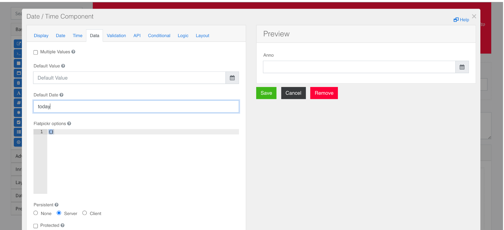
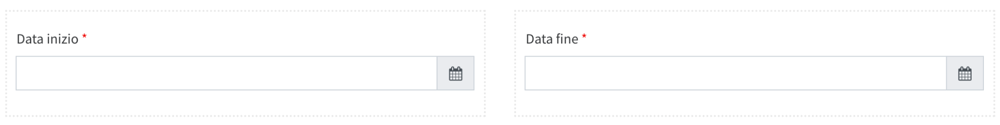

### Datetime
Implement the [standard configurations](../../base.md#the-following-properties-are-managed-in-the-components).  
With the datetime field you can manage fields **data** or **date and time**   
In the current version the field formatFormat  it is not managed in the configurator.

It is possible, by acting on the flag:**Enable Time Input** true/false, enable or disable the time in the form field. It is possible to activate the set date or today's date/time **Default Date a Today**

<font color=" #e74c3c">**Do not use the field to manage a specific year. If so, use a select resource.**</font>  

  

#### Datetime calendar range 


To manage a calendar **start date ~ end date** dynamic it is necessary to insert the two date fields, set **date**  or **datetime** is:
- dateStart
- dateEnd  

Then into the field **dateEnd** add the following Json logic:
```
[
    {
      "name": "check start",
      "trigger": {
        "type": "json",
        "json": {
          "var": "form.dateStart"
        }
      },
      "actions": [
        {
          "name": "update min",
          "type": "value",
          "value": "min={\"var\":\"form.dateStart\"}"
        }
      ]
    }
  ]
```