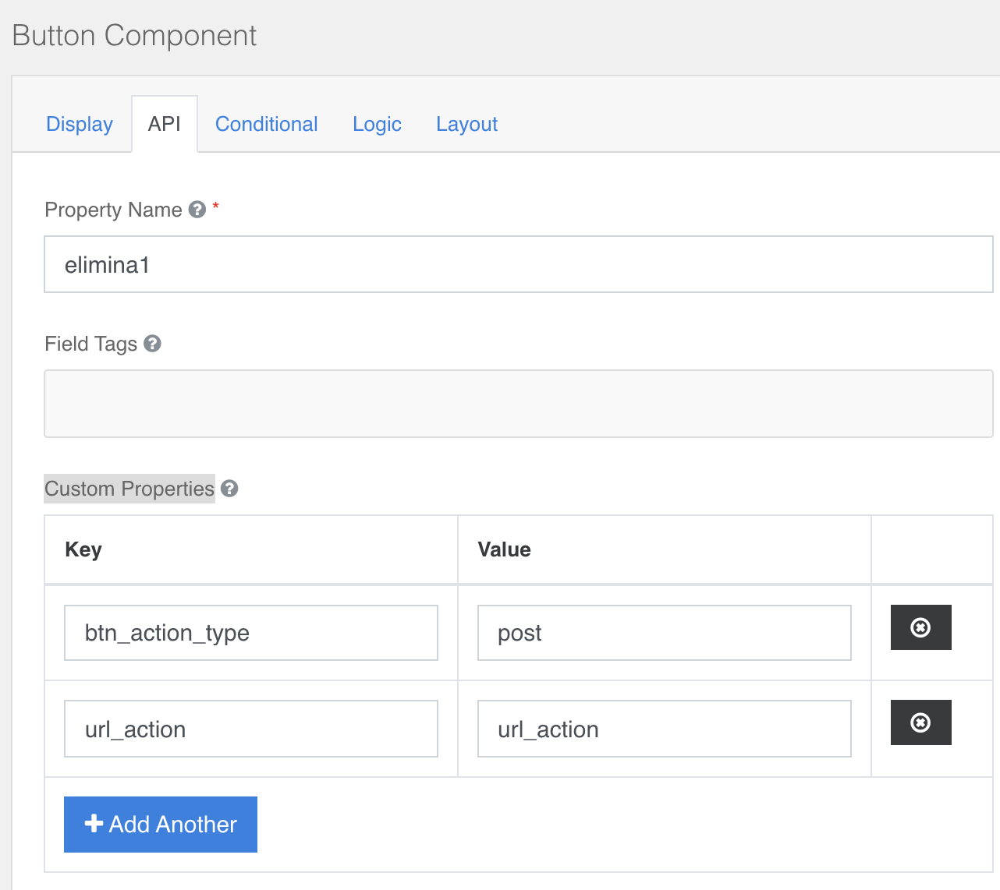

### Button
Button Action config section **Api → Custom Properties**  
**btn_action_type →** “post”(default)  
**url_action →** URL of the action you want to perform  
**leftIcon  or rightIcon →** optional [set an icon](../../base.md#icons) 

In case you want to use the button to add a record to an integrated table
add the following properties  
&nbsp;&nbsp;&nbsp;&nbsp;&nbsp;&nbsp;&nbsp;&nbsp;**all**: new_row,  
&nbsp;&nbsp;&nbsp;&nbsp;&nbsp;&nbsp;&nbsp;&nbsp;**default_fields**: {"rec_name":"parent"},  
&nbsp;&nbsp;&nbsp;&nbsp;&nbsp;&nbsp;&nbsp;&nbsp;**open_modal**: y → opens the form in a modal  

Or if you want to open a modal form, **modalEdit**: y  
Or if you want to export data from a collection:  
&nbsp;&nbsp;&nbsp;&nbsp;&nbsp;&nbsp;&nbsp;&nbsp;**export:** y  
&nbsp;&nbsp;&nbsp;&nbsp;&nbsp;&nbsp;&nbsp;&nbsp;**url_action:** /client/export/{nome_model}/{type} - type = xls,csv,json  
&nbsp;&nbsp;&nbsp;&nbsp;&nbsp;&nbsp;&nbsp;&nbsp;**body:** {"query": {"$and": [{"active": true}]}}  

