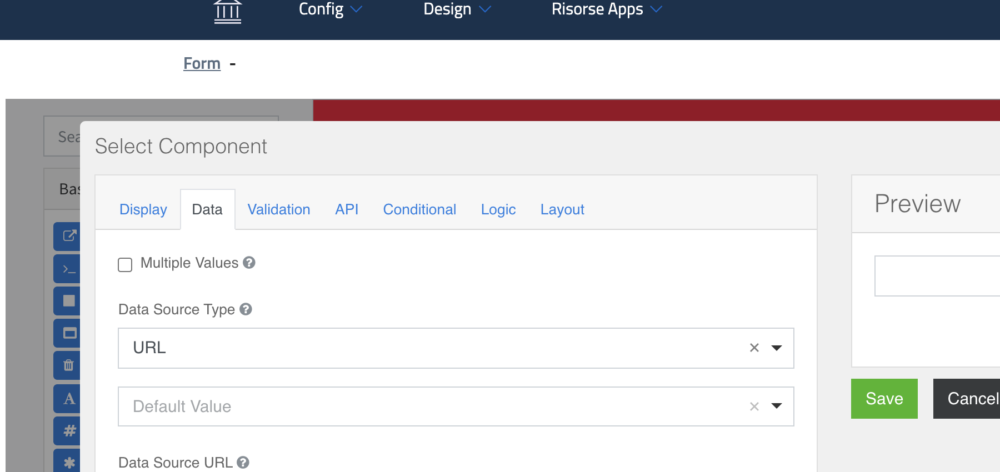
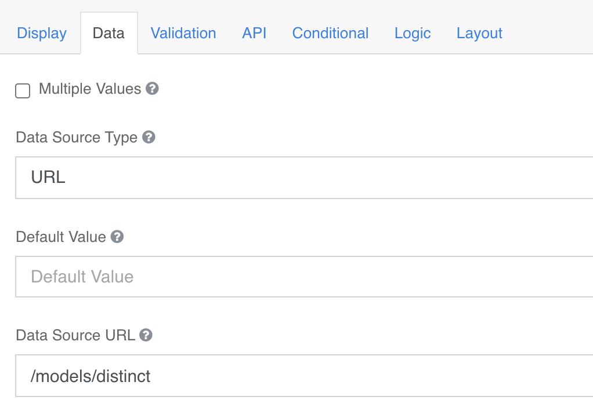
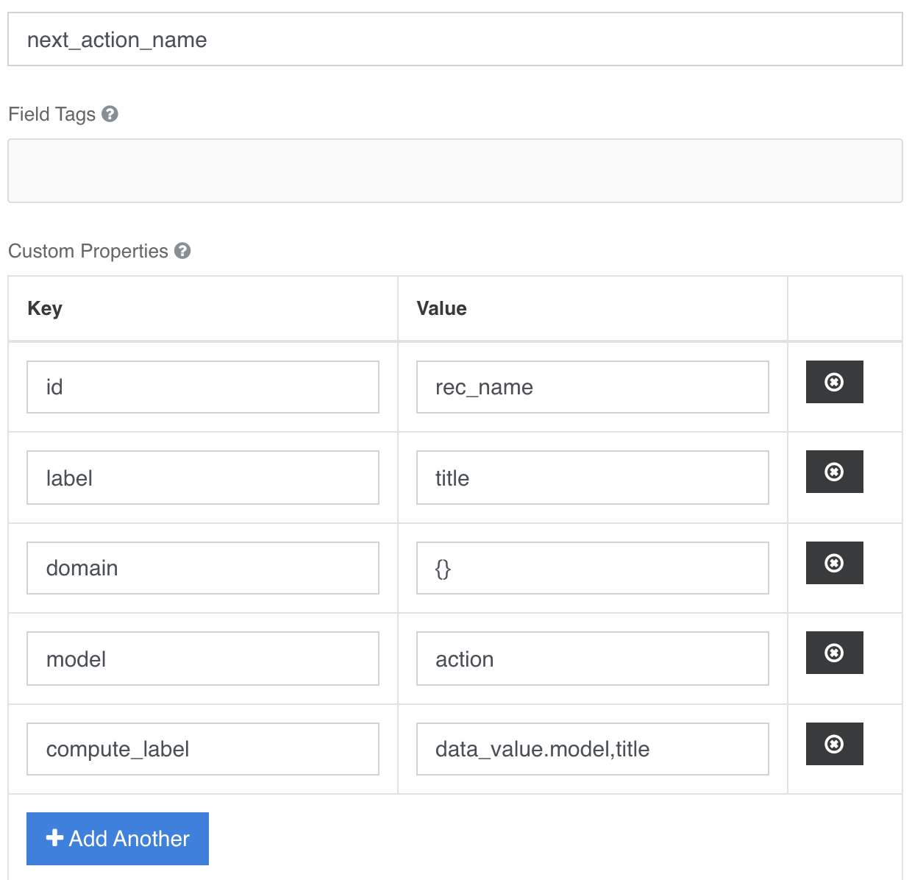

### Select
It is possible to use select fields in multiple ways, initially it is possible to manage them as:  
**Select single**  or **Select multiplo**; by checkingData --> Multiple values the select will be multiselect in the form.

#### External Form Data
It is possible to create a dropdown select with elements that are populated with values ​​from data inserted into another Form **not Resource**.  

**Tab Data configuration [fig.1]:**  
- Data Source Type → Url
- Data Source URL → /models/distinct

**Configurazione Tab API → Custom Properties [fig.2]:**  
- **Id →** rec_name (it is the value that is used as option val in the select list) 
- **label →** the name of the field considered indicative for the user (e.gTitle)
- **domain →** {} query domain to apply to reduce the list to the desired dataset
- **model →** the rec_name of the Form from which you want to extract the information.
- **compute_label →** [Optional] computes the label by combining the values ​​of multiple fields divided by “-”

For an example of complex use of the form you can see in: 

**Design → Form → Action Model** → Tab [ **Next Action**] → Field [**Next Action**] →
tab [**API**]

  

#### Computed value
Warning: specific code development is required for this functionality.  
To activate an automatic calculation of a field, the flag must be checked
**Calculate Value on server** and then add the method name inside the configuration **Calculated Value**

**The calculated values ​​will be updated only at save of the form and not to the change of information.**

The method must be placed in a class that it extends **ServiceAction** taking into account the correct inheritance chain of all installed plugins.

The method signature includes a parameter **data** dictionary type, input;  
this dictionary contains all the data of the record to be saved, it is therefore possible in the method to modify record values ​​as necessary before that data is saved.  
The method must return **data**, possibly modified.

[Return home](../../index.md)
