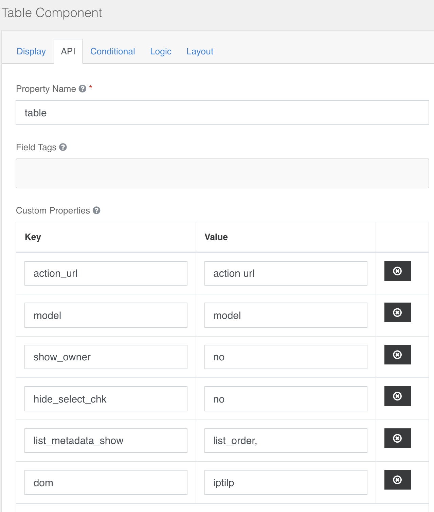

### Table:  
configurable section **Api → Custom Properties**  
**action_name→** the name (**rec_name**) of the action to use to populate the table
**action_url→** URL of the action  **/action/{action.rec_name}**  
**model→** the model (form.rec_name) linked to the table  
**show_owner→** default **"no"** , if different from no the column is displayed **owner_full_name** in the table  
**hide_select_chk →** default **"no"**, if different from no the column is hidden **checkbox** in the table  
**list_metadata_show→** you can add a list of [metadata fields](../../base.md#metadata) separated by comma, If you have a nested table (detail header form) use the field **parent**  
**dom→** default **content**,configuration of [dom in the datatable](https://datatables.net/reference/option/dom "dom")  
**Query →** default **{}**   
**calculateServer →** enter the name of a method that is executed when submitting the form, use only it is a table integrated into the detailed header form 

<table>
 <tr >
   <td valign=top>
       
       "action_url": "/action/list_people_list_users", 
      "model": "people_list_users", 
      "show_owner": "no", 
      "hide_select_chk": "no", 
      "list_metadata_show": "parent", 
      "home": "iptilp", 
      "query": "{}", 
      "action_name": "list_people_list_users", 
      "calculateServer": "eval_user_list", 
      "modal": "yes", 
      "copy_url":  action_url_copy , 
      "remove_url":  action_url_remove   
      Action_url_copy, action_url_remove must be urls in the format:/action/action_name  
      Where <b>action_name</b> it is the name field of the action that is possible Copy into the section <a href=https://docs.google.com/document/d/1eSXA8a7Gd9tm-iV7kv4eN7dPhJgc4OInUUwxjZ6DXpY/edit#bookmark=id.ci2ew347c7uv> Actions</a> for the desired action, copy and/or delete
   </td>
   <td>
   
   </td>
 </tr>
</table>

