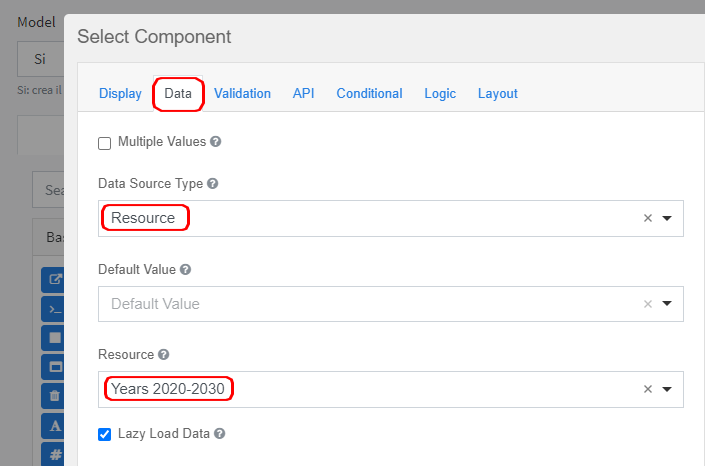
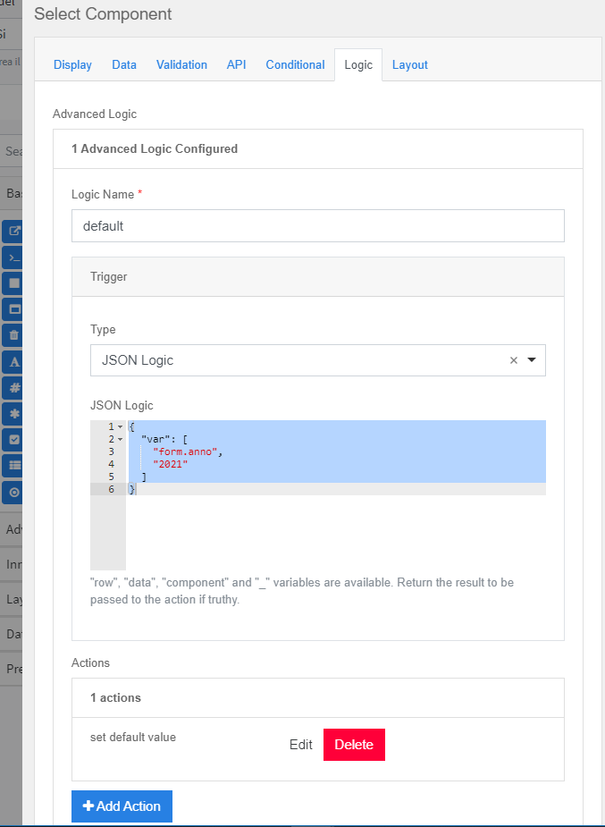
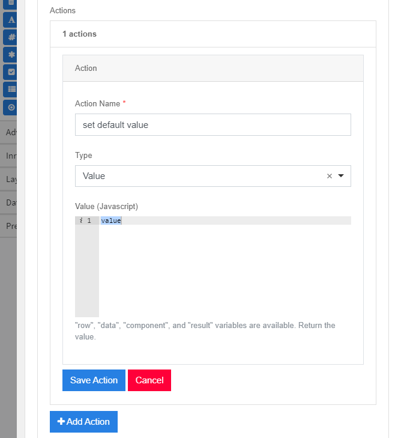

### In a select Resource type, define a default value

For example, select the year from Resource '**Years 2020-2030**’ 
(which contains the years 2020 to 2030)

To define 2021 as default is necessary  
1. define a logical rule in JSON:  
    The value of the 'year' field (the name can be read in the API tab) **year form**  it must be **2021**  
2. define the action named “**set default value**” type **Value**  

