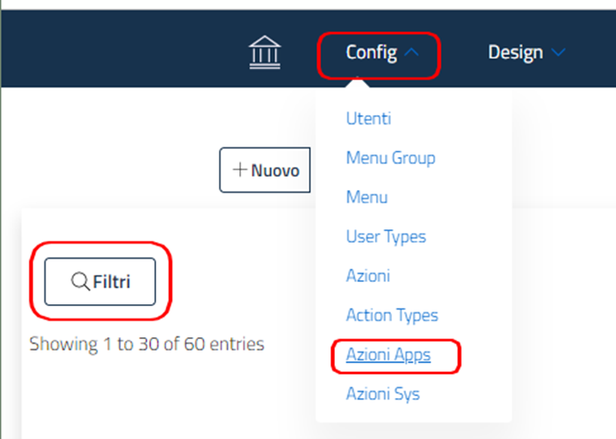
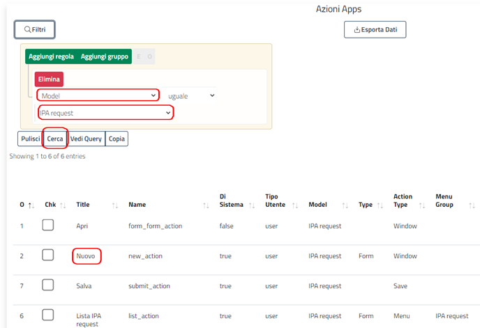
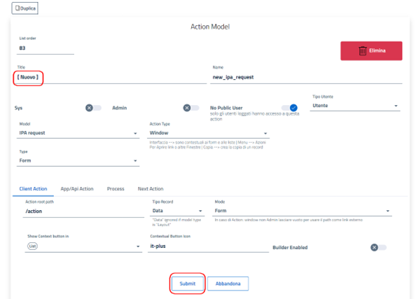
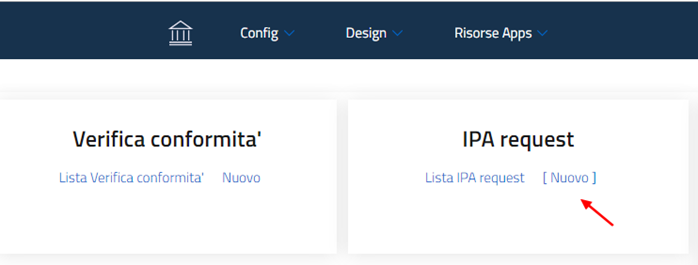

# Actions  
### Change the text of the 'New' function for the IPA Request form

Dal menu **Config**  to select **Shares Apps**  

  

Use the buttonFilters and add the rule:**Model = “model name”** it's with **IPA Request Model == IPA Request**  

Click on the element you want to modify: in this case the Title “**New**”  
write the new text, e.g. add square brackets,**[ New ]**  
and click on the button **Submit**  

Result:  

  

### Date filters in actions
It is possible to insert calculated date filters into actions using a system of meta commands:  

Dates only:  

**_date_today-10**  → 10 days after today:  
- If today is 10-10-2021  
- The result will be → 2021-10-20T00:00:00  

**_date_today-n-4** → 4 days before today  
- If today is 10-10-2021
- The result will be → 2021-10-06T00:00:00

In case the dates in the form are of type **DateTime** today must be considered in the query
As last second date 23:59:59  
For example, if you want to make a filter "Today” as of 20/20/2021 with a fieldDateTime in the form  
The query must consider from midnight to today last second:  
- 2021-10-20T00:00:00 <-> 2021-10-20T23:59:59  

**_date_today-10**  → 10 days after today:  
- If today is 10-10-2021
- The result will be → 2021-10-20T00:00:00  

**_date_today-10-max**  → 10 days after today:  
- If today is 10-10-2021
- The result will be → 2021-10-20T23:59:59  

It is also possible to use the max with the days in negative i.e. with the notation **“n”**.

[Return home](../index.md)