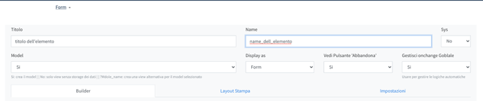

# Design  

## General
The form and consequently model design system is based on Formio.Js.  
For the list of available components that can be inserted on the forms, refer to [dedicated document](../index.md#L8)  

When creating a new Form/Resource element you can configure some basic data:  

**Title**: Title of the element, will be displayed as the header of the Card and as a base in the names of the default menus  
**Name**: It is the unique name of the form, used in the database as an index to search for the element itself.  
**Sys**: If set to The element is identified as a system element, a drop-down menu is created, it will not be visible in the cards and will only be accessible by Admins  
**Model:**  
- Yes → default→ a table is dynamically generated in the database where the data can be saved and the default actions are automatically generated
No → the form never requires saving data  
- ALL →name of a model→ the element is a different interface from the basic one for the selected model with a lower number of fields or arranged differently but which reads the data from the database table of the selected model, does not create the table in the database, but creates the actions by default  

**Display as**: TODO for now only FORM  
**See 'Quit' Button**:  Yes → displays theAbandon in the form, No → does not display it  
**Manage Global onchange**:if there are logics in the components set to "Yes" so that the form processes the logics when each field is modified  
Below the basic configurations there are tabs:  
**Builder**: → It is the area that implementsFormio.js builder and makes drag&drop components available to draw elements  
**Print Layout→** It is the area that allows you to draw a printable layout of the form.
It provides a simplified Word-type WYSIWYG component and it is possible to insert placeholders inside which will be enhanced with the data of the **Form**
The form placeholders must be entered with notation [Jinja2 Templating](https://jinja.palletsprojects.com/en/3.0.x/templates/)  

All forms are saved in the table **Component** of the database.  
Depending on the menu type, the type field of the Component record created by the builder sets the specific value:  
1. **Form** → Component.type = “form”  
2. **Risorse**→ Component.type = ”resource”  
3. **Layout**→ Component.type = ”layout” (Wip)

[Return home](../index.md)