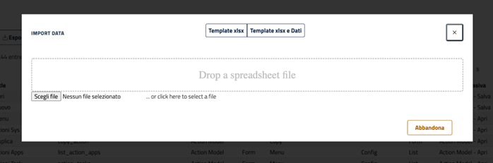

# Import data from excel file

If you are an administrator user of the App, it is possible to import records from an Excel file in each list.  

Access the list of the functionality whose data you want to import, so if you are an administrator the button will be present **Import**  

By clicking on the button **import** and a popup opens  

At this point it is possible to act in two ways:  
1. **Template xlsx** : Download an xlsx template file, containing the column headers compatible with the subsequent import, then the rows with the data can be added.  
2. **Template xlsx and Data**:Download the template and all the data of the table on which it is possible to act by modifying, adding or deleting data or records  

During the editing of the preparatory Excel file with the import it is possible to add a column with a header to the file in any position (beginning, end, middle etc..)**owner_uid**, and setting in the lines a **uid** specify (eg admin, first name, etc.)
The username can be the same or different for each row.  
Once the file has been edited in this way, during the import phase the record is inserted with the specific ownership for the user indicated in the value in the column **owner_uid**, in this way the specific functions provided for the owner's records can be used.  

Once the template compatible with the subsequent import has been downloaded and once it has been drawn up, it is possible to import the data by loading the file into the interface or via drag&drop or via the button **Choose file**.  

Once the file has been uploaded, the data is displayed in a grid, so it will be possible to act as follows to complete the import procedure:  
1. Optional tick the checkboxDelete EVERYTHING and import
2. Press the import button  

**Attention!**:the procedure does not provide for the possibility of being cancelled, especially if the checkbox has been ticked **Delete Everything**, so once you click import all the data on the system is deleted and then the data loaded with the files is inserted as new data.  

If it doesn't tick **Delete EVERYTHING and import** the data present where the value **rec_name** is present in the database, those not present are updated, new ones are created.  

[Return home](../index.md)