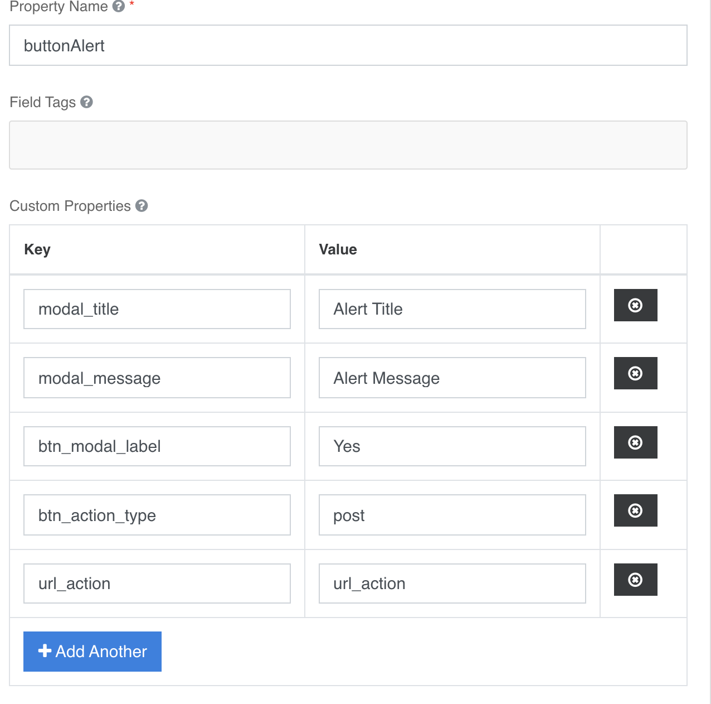

#### Button Alert
Pulsante Azione con alert configurabile: sezione **Api → Custom Properties**
**modal_title →** titolo della modale  
**modal_message →** messaggio di avviso che si vuole visualizzare  
**btn_modal_label →** Testo del pulsante “SI” (valore default)  
**btn_action_type →** Post (default)  
**url_action →** url dell’azione che si vuole eseguire  

