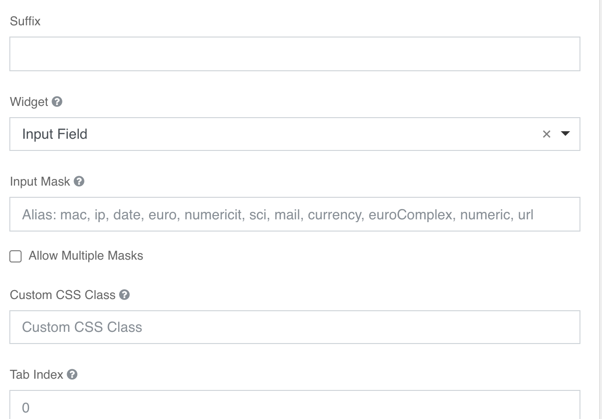

### Textfield
Campo di testo input. Oltre alle [configurazioni standard](../../base.md#Neicomponentisonogestiteleseguentiproprietà) è gestito il mask per tipo d valore che si vuole utilizzare; i valori ammessi sono: **'mac', 'ip', 'date', 'euro', 'numericit', 'sci', 'mail', 'currency', 'euroComplex', 'numeric', 'url'**; è presente un help nel tooltip.

