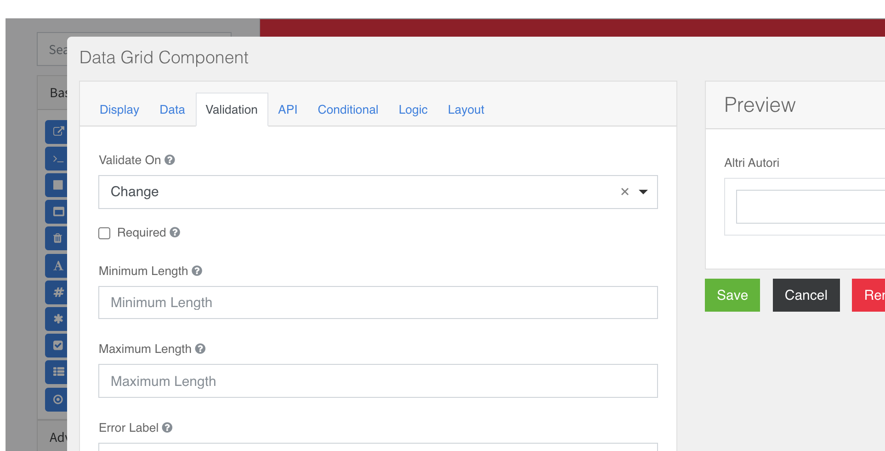

### Datagrid
Il datagrid è un componente che può contenere altri componenti.  
Per attivare la possibilità  di aggiungere più righe in un datagrid è necessario valorizzare i campi **Minimum Length , Maximum Length** nel tab **Validation** in fase di configurazione del componente: es **Minimum Length: 1 , Maximum Length: 4** attiva il datagrid con la prima riga di default non eliminabile e il pulsante “+” per aggiungere righe fino ad un massimo di 4.   

In fase di creazione di una pannello **datagrid** per gestire il layout delle righe del componente e’ necessario inserire nel componente, prima di ogni altro componente per la gestione di dati un componente di tipo [column](../layout/columns.md#Columns) in modo da definire la dimensione delle colonne