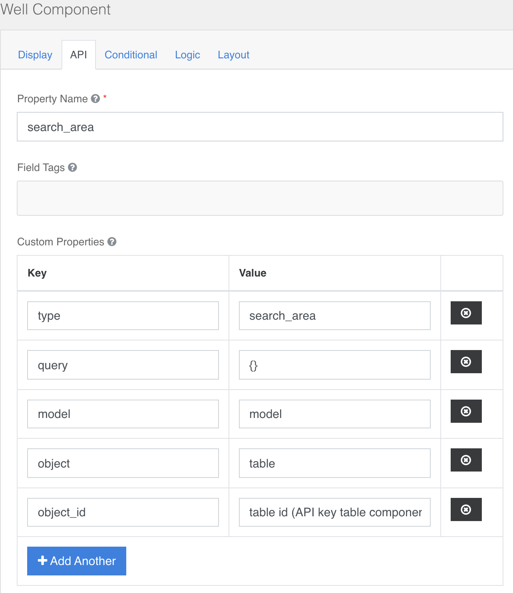

### Search Area
Utilizza il componente nativo Well di Formio.js.

configurabile sezione **Api → Custom Properties**  
Necessita di configurazioni; è il componente che viene utilizzato in tutte le view lista dei form.  
**Type → “search_area”** per ora unica opzione di configurazione del well component  
**Object_id →** una stringa univoca che identifica **l’id** html del componente  
**model→** il model (form) di riferimento per popolare i filtri  
**Query →** la query di default da impostare quando il componente viene creato in caso sia impostato un object (tabella) correlata. Se non si vuole usare lasciare il default proposto **{ }**  
**object[Optional] →**  se impostato con id (**property Name**) di un componente **Table**, viene visualizzato il pulsante cerca e tale pulsante agisce sulla tabella **object**

