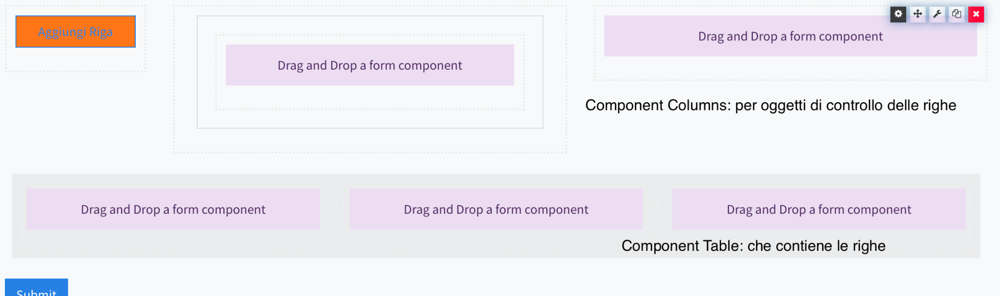

### Struttura testata/dettaglio
1. Preparare il form di testata   
2. Preparare il form da utilizzare per gestire le righe  
3. Aggiornare il form di testata aggiungendo i seguenti componenti:  



Nel [columns](../layout/columns.md#Columns) aggiungere un [pulsante per aggiungere](../base/button.md#Button) le righe nella tabella  
Aggiungere una [Search Area](../data/search_area.md#SearchArea) per definire la relazione di default tra i due form  
Per quanto riguarda la Search Area e’ importante che:  
- La proprieta’ query sia → **query** {'parent':''}  
- La logica di base (json logic):  
```
"logic": [
    {
      "name": "all",
      "trigger": {
        "type": "json",
        "json": {
          "var": "form.rec_name"
        }
      },
      "actions": [
        {
          "name": "eval query",
          "type": "value",
          "value": "query={\"cat\":[\n   {'$and':[{'parent':'\",\n       
                          {\"var\":\"form.rec_name\"},\n    \"'}]}\"\n]}"
        }
      ]
    }
  ]
```
In fine aggiungere la [tabella che conterra’ le righe attivando anche copia ed elimina](../data/table.md#Table)


[torna alla home](../../index.md)
