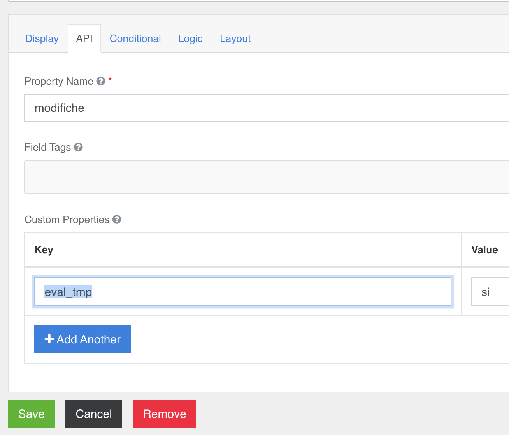

### Content
Non necessita di configurazioni aggiuntive; se necessario usare le [configurazioni standard](../../base.md#Neicomponentisonogestiteleseguentiproprietà).

E’ possibile configurare il componente content i tre modalità:  
- Semplice contenuto Html redatto al momento in cui viene disegnato il form  
- Attivare un editor inserendo la configurazione “**editor**” nel configuratore nella sezione **API → Custom Properties** => key: **editor**, value: **si**  
- Attivare il rendering dei contenuti inseriti nell’editor del configuratore, inserendo la configurazione “**eval_tmp**” nel configuratore nella sezione **API → Custom Properties** => key: **eval_tmp**, value: **si**  

  
