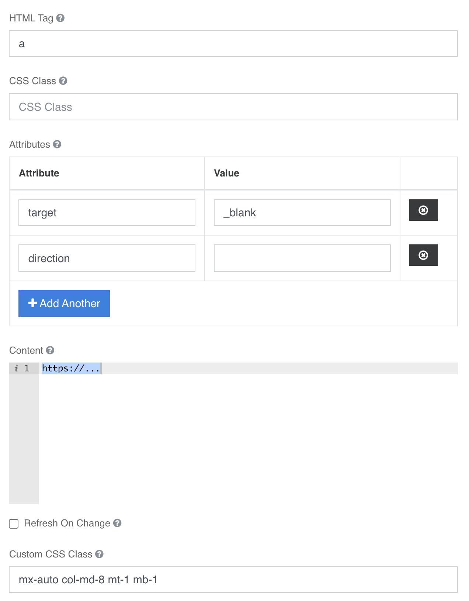

### Link
Crea un tag a link sul form, estende htmlelement. Oltre alle configurazioni [configurazioni standard](../../base.md#Neicomponentisonogestiteleseguentiproprietà) e’ possibile configurarlo come segue  

**Content: →** inserire il link che sarà gestito dall’attributo href del tag a  
**Attributes:** è possibile inserire con chiave valore 
- **Target:** →  default _self,  _blank
- **Icon:** → default **no image**, o una scelta delle [icone disponibili](../../base.md#Icone)

[torna alla home](../../index.md)
