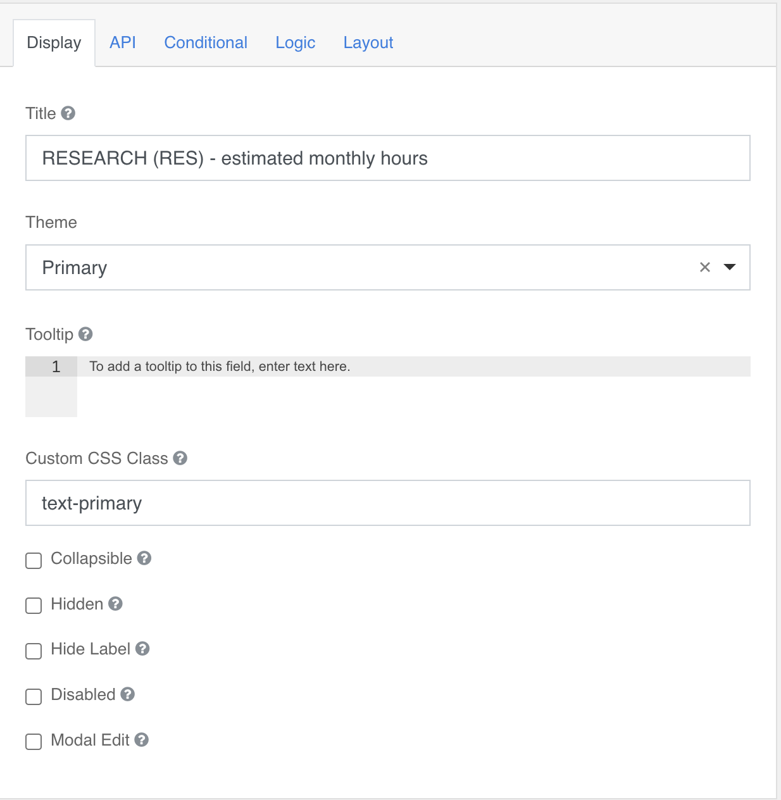
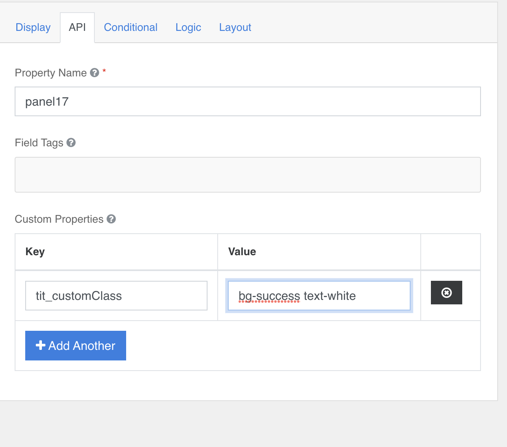

### Panel
Non necessita di configurazioni aggiuntive; se necessario usare le [configurazioni standard](../../base.md#Neicomponentisonogestiteleseguentiproprietà). 

Controllare il folding tramite **Collapsible** se impostato viene disegnato il pannello con l’header, la label e la possibilità di essere aperto e chiuso.  

### Solo titolo e sfondo:

<table>
  <tr >
	<td>
  	
	</td>
	<td valign=top>
  	Per impostare solamente il titolo del pannello si deve lasciare la configurazione come in immagine a lato
	</td>
  </tr>
</table>

<table>
  <tr >
	<td>
  	
	</td>
	<td valign=top>
  	A questo punto e’ possibile impostare un colore di sfondo con la seguente configurazione (come immagine):  
    Sezione Api -> Custom Properties:
    Aggiungere la proprieta’ : <b>tit_customClass</b>
    E valorizzare con:  <a href= https://italia.github.io/bootstrap-italia/1.x/docs/utilities/colori/#colore-di-sfondo>valori selezionati al link</a href>
    Nell’esempio → <b>bg-success text-white</b>
    <u>Senza virgole o punti.</u>
	</td>
  </tr>
</table>

[torna alla home](../../index.md)
