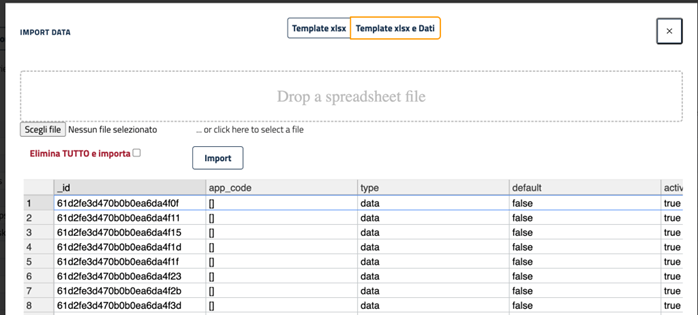

# Import dei dati da file excel

Se si e’ utenti amministratori della App e’ possibile in ogni lista importare record da un file excel.

Accedere alla lista della funzionalita’ di cui si vuole importare i dati quindi se si e’ amministratori sra’ presente il pulsante **Import**

Cliccando sul pulsante **import** e si apre un popup 

A questo punto e’ possibile agire in due modalita:

1. **Template xlsx** : Scarica un  file xlsx  template, contenente l’intestazione della colonne compatibile con la successiva importazione, quindi si possono aggiungere le righe con i dati.
2. **Template xlsx e Dati**: Scarica il template e tutti i dati della tabella su cui e’ possbile agire modificando aggiungendo o eliminando dati o records

Durante l’editing del file excel propedeutico con l’ import e’ possibile aggiungere al file in qualsiasi posizione, (inizio, fine, in meta’ ecc..), una colonna con intestazione **owner_uid**, e impostando nelle righe un **uid** specifco  (es. admin,  n.cognome  ecc… )  
Il nome utente puo’ essere uguale o diverso per ogni riga.  
Una volta editato il file in questo modo in fase di import il record viene inserito con la ownership specifica per l'utente indicato nel valore alla colonna **owner_uid**, in questo modo potranno essere utilizzate le funzionalita’ specifiche previste per i record del proprietario.

Eseguito il download del template compatibile con il successivo import e una volta redatto il medesimo e’ possibile eseguire l’importazione dei dati caricando il file nell’interfaccia o tramite drag&drop oppure tramite il pulsante **Scegli file**.

Caricato il file i dati vengono visualizzati in una griglia, quindi sra’ possibile agire come segue per completare la procedura d’importazione:

1. Opzionale spuntare il checkbox **Elimina TUTTO e importa**  
2. Premere il pulsante importa 

**Attenzione!**: la procedura non prevede non prevede la possibilita’ di essere annullata, soprattutto se e’ stato spuntato il checkbox **Elimina Tutto**, quindi una volta cliccato import tutti i dati presenti sul sistema vengono eliminati e quindi i dati caricati con i file vengono inseriti come nuovi dati.

Se invece non si spunta **Elimina TUTTO e importa** i dati presenti dove il valore **rec_name** e’ presente sul database vengono aggiornati quelli non presenti vengono creati nuovi.

[torna alla home](../index.md)
